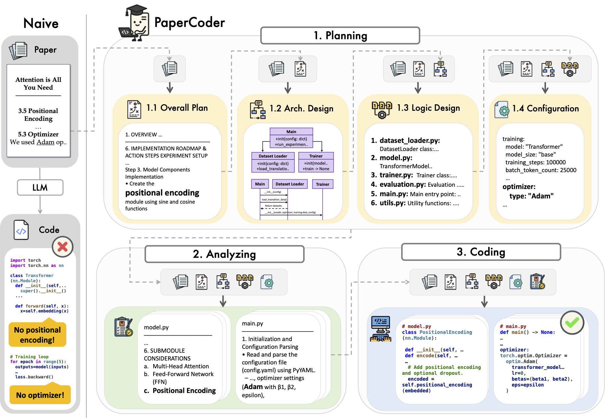

# 📄 Paper2Code: Automating Code Generation from Scientific Papers in Machine Learning



📄 [Read the paper on arXiv](https://arxiv.org/abs/2504.17192)

**PaperCoder** is a multi-agent LLM system that transforms paper into a code repository.
It follows a three-stage pipeline: planning, analysis, and code generation, each handled by specialized agents.  
Our method outperforms strong baselines on both Paper2Code and PaperBench and produces faithful, high-quality implementations.

---

## 🗺️ Table of Contents

- [⚡ Quick Start](#-quick-start)
- [📚 Detailed Setup Instructions](#-detailed-setup-instructions)
- [📦 Paper2Code Benchmark Datasets](#-paper2code-benchmark-datasets)
- [📊 Model-based Evaluation of Repositories](#-model-based-evaluation-of-repositories-generated-by-papercoder)

---

## ⚡ Quick Start
- Note: The following command runs example paper ([Attention Is All You Need](https://arxiv.org/abs/1706.03762)).  

### Using OpenAI API
- 💵 Estimated cost for using o3-mini: $0.50–$0.70

```bash
pip install openai

export OPENAI_API_KEY="<OPENAI_API_KEY>"

cd scripts
bash run.sh
```

### Using Open Source Models with vLLM
- If you encounter any issues installing vLLM, please refer to the [official vLLM repository](https://github.com/vllm-project/vllm).
- The default model is `deepseek-ai/DeepSeek-Coder-V2-Lite-Instruct`.

```bash
pip install vllm

cd scripts
bash run_llm.sh
```

### Output Folder Structure (Only Important Files)
```bash
outputs
├── Transformer
│   ├── analyzing_artifacts
│   ├── coding_artifacts
│   └── planning_artifacts
└── Transformer_repo # Final output repository
```
---

## 📚 Detailed Setup Instructions

### 🛠️ Environment Setup

- 💡 To use the `o3-mini` version, make sure you have the latest `openai` package installed.
- 📦 Install only what you need:
  - For OpenAI API: `openai`
  - For open-source models: `vllm`
      - If you encounter any issues installing vLLM, please refer to the [official vLLM repository](https://github.com/vllm-project/vllm).


```bash
pip install openai 
pip install vllm 
```

- Or, if you prefer, you can install all dependencies using `pip`:

```bash
pip install -r requirements.txt
```

### 📄 (Option) Convert PDF to JSON
The following process describes how to convert a paper PDF into JSON format.  
If you have access to the LaTeX source and plan to use it with PaperCoder, you may skip this step and proceed to [🚀 Running PaperCoder](#-running-papercoder).  
Note: In our experiments, we converted all paper PDFs to JSON format.

1. Clone the `s2orc-doc2json` repository to convert your PDF file into a structured JSON format.  
   (For detailed configuration, please refer to the [official repository](https://github.com/allenai/s2orc-doc2json).)

```bash
git clone https://github.com/allenai/s2orc-doc2json.git
```

2. Run the PDF processing service.

```bash
cd ./s2orc-doc2json/grobid-0.7.3
./gradlew run
```

3. Convert your PDF into JSON format.

```bash
mkdir -p ./s2orc-doc2json/output_dir/paper_coder
python ./s2orc-doc2json/doc2json/grobid2json/process_pdf.py \
    -i ${PDF_PATH} \
    -t ./s2orc-doc2json/temp_dir/ \
    -o ./s2orc-doc2json/output_dir/paper_coder
```

### 🚀 Running PaperCoder
- Note: The following command runs example paper ([Attention Is All You Need](https://arxiv.org/abs/1706.03762)).  
  If you want to run PaperCoder on your own paper, please modify the environment variables accordingly.

#### Using OpenAI API
- 💵 Estimated cost for using o3-mini: $0.50–$0.70


```bash
# Using the PDF-based JSON format of the paper
export OPENAI_API_KEY="<OPENAI_API_KEY>"

cd scripts
bash run.sh
```

```bash
# Using the LaTeX source of the paper
export OPENAI_API_KEY="<OPENAI_API_KEY>"

cd scripts
bash run_latex.sh
```


#### Using Open Source Models with vLLM
- The default model is `deepseek-ai/DeepSeek-Coder-V2-Lite-Instruct`.

```bash
# Using the PDF-based JSON format of the paper
cd scripts
bash run_llm.sh
```

```bash
# Using the LaTeX source of the paper
cd scripts
bash run_latex_llm.sh
```

---

## 📦 Paper2Code Benchmark Datasets
- Huggingface dataset: [paper2code](https://huggingface.co/datasets/iaminju/paper2code)
  
- You can find the description of the Paper2Code benchmark dataset in [data/paper2code](https://github.com/going-doer/Paper2Code/tree/main/data/paper2code). 
- For more details, refer to Section 4.1 "Paper2Code Benchmark" in the [paper](https://arxiv.org/abs/2504.17192).


---

## 📊 Model-based Evaluation of Repositories Generated by PaperCoder

- We evaluate repository quality using a model-based approach, supporting both reference-based and reference-free settings.  
  The model critiques key implementation components, assigns severity levels, and generates a 1–5 correctness score averaged over 8 samples using **o3-mini-high**.

- For more details, please refer to Section 4.3.1 (*Paper2Code Benchmark*) of the paper.
- **Note:** The following examples evaluate the sample repository (**Transformer_repo**).  
  Please modify the relevant paths and arguments if you wish to evaluate a different repository.

### 🛠️ Environment Setup
```bash
pip install tiktoken
export OPENAI_API_KEY="<OPENAI_API_KEY>"
```


### 📝 Reference-free Evaluation
- `target_repo_dir` is the generated repository.

```bash
cd codes/
python eval.py \
    --paper_name Transformer \
    --pdf_json_path ../examples/Transformer_cleaned.json \
    --data_dir ../data \
    --output_dir ../outputs/Transformer \
    --target_repo_dir ../outputs/Transformer_repo \
    --eval_result_dir ../results \
    --eval_type ref_free \
    --generated_n 8 \
    --papercoder
```

### 📝 Reference-based Evaluation
- `target_repo_dir` is the generated repository.
- `gold_repo_dir` should point to the official repository (e.g., author-released code).

```bash
cd codes/
python eval.py \
    --paper_name Transformer \
    --pdf_json_path ../examples/Transformer_cleaned.json \
    --data_dir ../data \
    --output_dir ../outputs/Transformer \
    --target_repo_dir ../outputs/Transformer_repo \
    --gold_repo_dir ../examples/Transformer_gold_repo \
    --eval_result_dir ../results \
    --eval_type ref_based \
    --generated_n 8 \
    --papercoder
```


### 📄 Example Output
```bash
========================================
🌟 Evaluation Summary 🌟
📄 Paper name: Transformer
🧪 Evaluation type: ref_based
📁 Target repo directory: ../outputs/Transformer_repo
📊 Evaluation result:
        📈 Score: 4.5000
        ✅ Valid: 8/8
========================================
🌟 Usage Summary 🌟
[Evaluation] Transformer - ref_based
🛠️ Model: o3-mini
📥 Input tokens: 44318 (Cost: $0.04874980)
📦 Cached input tokens: 0 (Cost: $0.00000000)
📤 Output tokens: 26310 (Cost: $0.11576400)
💵 Current total cost: $0.16451380
🪙 Accumulated total cost so far: $0.16451380
============================================
```
